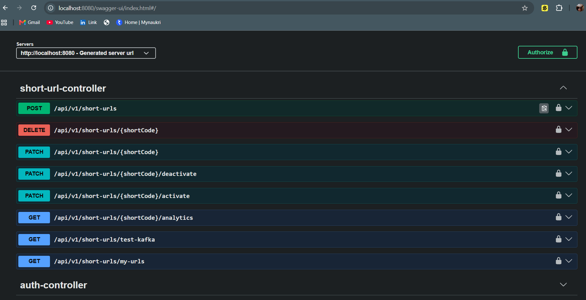
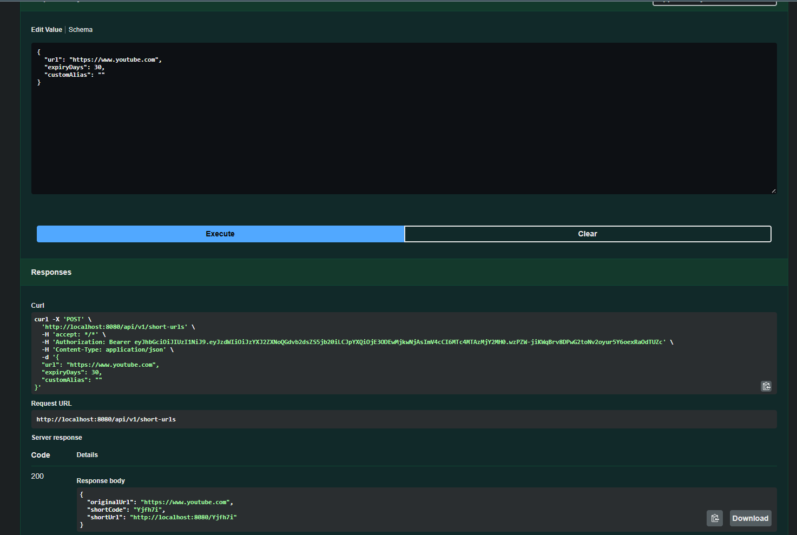
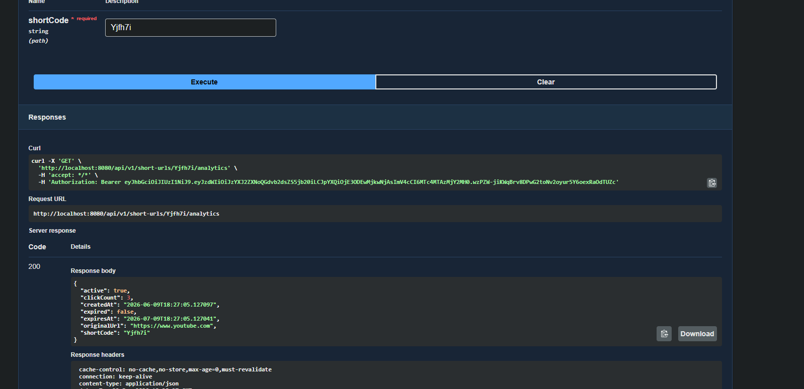
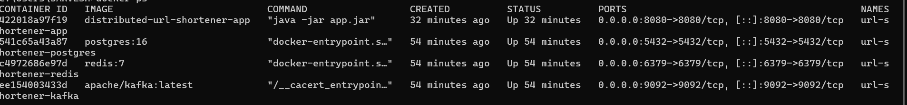
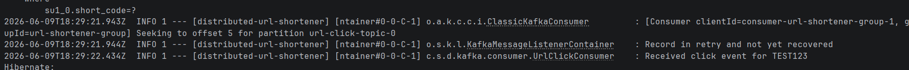

# Distributed URL Shortener

A scalable URL shortening service built using Spring Boot, PostgreSQL, Redis, Kafka, JWT Authentication and Docker.

## Features

* User Registration & Login (JWT Authentication)
* Create Short URLs
* Custom Alias Support
* URL Expiration
* URL Analytics
* Activate / Deactivate URLs
* Delete URLs
* Redis Caching
* Rate Limiting
* Kafka-based Click Event Processing
* Dockerized Deployment
* Swagger API Documentation

---

## Tech Stack

### Backend

* Java 21
* Spring Boot
* Spring Security
* Spring Data JPA

### Database

* PostgreSQL

### Caching

* Redis

### Messaging

* Apache Kafka

### Authentication

* JWT

### Containerization

* Docker
* Docker Compose

---

## Architecture

Client

↓

Spring Boot Application

├── PostgreSQL

├── Redis Cache

└── Kafka

↓

Analytics Consumer

---

## API Endpoints

### Authentication

POST /api/v1/auth/register

POST /api/v1/auth/login

### Short URLs

POST /api/v1/short-urls

GET /api/v1/short-urls/my-urls

GET /api/v1/short-urls/{shortCode}/analytics

PATCH /api/v1/short-urls/{shortCode}

PATCH /api/v1/short-urls/{shortCode}/activate

PATCH /api/v1/short-urls/{shortCode}/deactivate

DELETE /api/v1/short-urls/{shortCode}

### Kafka Test

GET /api/v1/short-urls/test-kafka

---

## Running Locally

### Clone Repository

git clone https://github.com/yourusername/distributed-url-shortener.git

cd distributed-url-shortener

### Start Services

docker compose up -d

### Access Swagger

http://localhost:8080/swagger-ui/index.html

---

## Kafka Flow

1. User accesses short URL
2. Producer publishes UrlClickedEvent
3. Kafka Topic receives event
4. Consumer processes event
5. Click count is updated asynchronously

## Screenshots

---

## Future Improvements

* Custom Domain Support
* QR Code Generation
* Click Analytics Dashboard
* Geographic Analytics
* AWS Deployment

---

## Author

Sarvesh Bhushan
